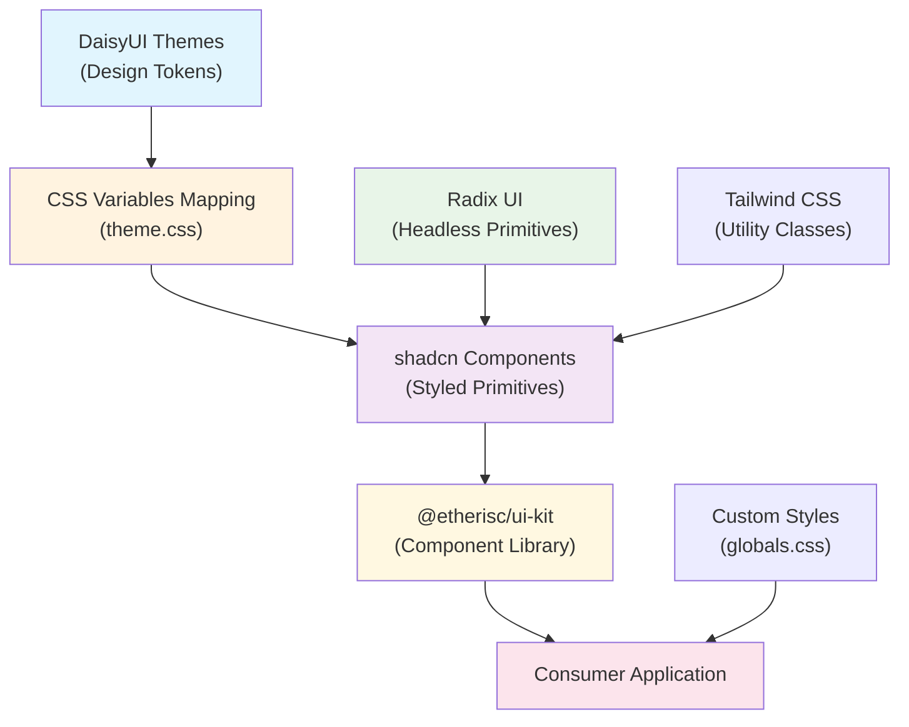

# **Complete Setup Guide: Radix UI + shadcn + DaisyUI Design System**

This guide provides comprehensive instructions for consuming applications to properly integrate the `@etherisc/ui-kit` design system.

## **📐 Architecture Overview**

The design system uses a **layered approach** combining three powerful libraries:

1. **Radix UI** - Provides headless, accessible component primitives
2. **shadcn/ui** - Provides styled component patterns and utilities
3. **DaisyUI** - Provides semantic CSS classes and design tokens

The system bridges these through a **custom CSS variable mapping** that allows DaisyUI themes to power shadcn components.



## **🚀 Step-by-Step Setup for Consuming Applications**

### **Step 1: Install Required Dependencies**

```bash
# Core dependencies
npm install @etherisc/ui-kit

# Peer dependencies (required)
npm install react@>=18.0.0 react-dom@>=18.0.0

# Additional dependencies for forms (optional)
npm install react-hook-form@^7.56.4 @hookform/resolvers@^3.6.1 zod@^3.25.7
```

### **Step 2: Install and Configure Tailwind CSS + DaisyUI**

```bash
# Install styling dependencies
npm install -D tailwindcss@^3.4.17 postcss@^8.5.3 autoprefixer@^10.4.21
npm install -D daisyui@^5.0.35 tailwindcss-animate@^1.0.7

# Initialize Tailwind (if not already done)
npx tailwindcss init -p
```

### **Step 3: Configure Tailwind CSS**

Create or update your `tailwind.config.js`:

```javascript
import daisyui from "daisyui";
import tailwindcssAnimate from "tailwindcss-animate";

/** @type {import('tailwindcss').Config} */
export default {
  content: [
    "./index.html",
    "./src/**/*.{js,ts,jsx,tsx}",
    // Include the ui-kit components for proper class detection
    "./node_modules/@etherisc/ui-kit/dist/**/*.{js,jsx}",
  ],
  darkMode: ["class"],
  theme: {
    extend: {
      colors: {
        // Essential shadcn color mappings
        border: "hsl(var(--border))",
        input: "hsl(var(--input))",
        ring: "hsl(var(--ring))",
        background: "hsl(var(--background))",
        foreground: "hsl(var(--foreground))",
        primary: {
          DEFAULT: "hsl(var(--primary))",
          foreground: "hsl(var(--primary-foreground))",
        },
        secondary: {
          DEFAULT: "hsl(var(--secondary))",
          foreground: "hsl(var(--secondary-foreground))",
        },
        accent: {
          DEFAULT: "hsl(var(--accent))",
          foreground: "hsl(var(--accent-foreground))",
        },
        destructive: {
          DEFAULT: "hsl(var(--destructive))",
          foreground: "hsl(var(--destructive-foreground))",
        },
        card: {
          DEFAULT: "hsl(var(--card))",
          foreground: "hsl(var(--card-foreground))",
        },
        popover: {
          DEFAULT: "hsl(var(--popover))",
          foreground: "hsl(var(--popover-foreground))",
        },
        success: {
          DEFAULT: "hsl(var(--success))",
          foreground: "hsl(var(--success-foreground))",
        },
        warning: {
          DEFAULT: "hsl(var(--warning))",
          foreground: "hsl(var(--warning-foreground))",
        },
        info: {
          DEFAULT: "hsl(var(--info))",
          foreground: "hsl(var(--info-foreground))",
        },
        muted: {
          DEFAULT: "hsl(var(--muted))",
          foreground: "hsl(var(--muted-foreground))",
        },
      },
      borderRadius: {
        lg: "var(--radius)",
        md: "calc(var(--radius) - 2px)",
        sm: "calc(var(--radius) - 4px)",
      },
      boxShadow: {
        sm: "var(--shadow-sm)",
        DEFAULT: "var(--shadow)",
        md: "var(--shadow-md)",
        lg: "var(--shadow-lg)",
      },
    },
  },
  plugins: [daisyui, tailwindcssAnimate],
  daisyui: {
    themes: ["light", "dark"],
    base: true,
    styled: true,
    utils: true,
    prefix: "",
    logs: false,
    themeRoot: ":root",
  },
};
```

### **Step 4: Import Required Styles**

In your main CSS file (e.g., `src/index.css` or `src/main.css`):

```css
/* Import the complete design system styles */
@import "@etherisc/ui-kit/dist/style.css";

/* Include Tailwind utilities */
@tailwind base;
@tailwind components;
@tailwind utilities;

/* Optional: Add your custom base styles */
@layer base {
  body {
    @apply bg-background text-foreground;
  }
}
```

### **Step 5: Set Up React Providers**

In your main app entry point (e.g., `src/main.tsx` or `src/App.tsx`):

```tsx
import React from "react";
import { createRoot } from "react-dom/client";
import {
  ThemeProvider,
  ToastProvider,
  ErrorBoundary,
  I18nProvider,
} from "@etherisc/ui-kit";
import "./index.css"; // Your CSS file with the imports above

function App() {
  return (
    <ErrorBoundary>
      <I18nProvider>
        <ThemeProvider defaultTheme="light" storageKey="app-theme">
          <ToastProvider>
            {/* Your app content goes here */}
            <YourAppContent />
          </ToastProvider>
        </ThemeProvider>
      </I18nProvider>
    </ErrorBoundary>
  );
}

// Root setup
const container = document.getElementById("root");
if (!container) throw new Error("Failed to find the root element");

const root = createRoot(container);
root.render(
  <React.StrictMode>
    <App />
  </React.StrictMode>,
);
```

### **Step 6: Configure Theme for DaisyUI (Optional)**

To ensure DaisyUI components render correctly, you may need to set the theme attribute:

```tsx
// In your main app or index.html
useEffect(() => {
  // Set DaisyUI theme on HTML element
  document.documentElement.setAttribute("data-theme", "light");
}, []);
```

Or in your `index.html`:

```html
<html lang="en" data-theme="light">
  <!-- ... -->
</html>
```

## **🔧 Essential Configuration Details**

### **Provider Configuration Options**

#### **ThemeProvider**

```tsx
<ThemeProvider
  defaultTheme="light"           // "light" | "dark" | "system"
  storageKey="my-app-theme"      // localStorage key for persistence
  themes={["light", "dark"]}     // Available theme options
>
```

#### **ToastProvider**

```tsx
<ToastProvider
  position="top-right"           // Toast positioning
  duration={4000}               // Default toast duration
>
```

#### **I18nProvider**

```tsx
<I18nProvider
  defaultLanguage="en"          // Default language
  supportedLanguages={["en", "de", "fr"]}  // Supported languages
>
```

### **Key CSS Variables Available**

The design system provides these CSS variables that you can customize:

```css
:root {
  /* Core colors (mapped from DaisyUI) */
  --primary: hsl(var(--p));
  --primary-foreground: hsl(var(--pc));
  --secondary: hsl(var(--s));
  --background: hsl(var(--b1));
  --foreground: hsl(var(--bc));
  --border: hsl(var(--b2));

  /* Status colors */
  --success: hsl(var(--su));
  --warning: hsl(var(--wa));
  --error: hsl(var(--er));
  --info: hsl(var(--in));

  /* UI elements */
  --radius: 0.5rem;
  --shadow-sm: /* ... */;
  --shadow: /* ... */;
  --shadow-md: /* ... */;
  --shadow-lg: /* ... */;
}
```

## **📝 Usage Examples**

### **Basic Component Usage**

```tsx
import {
  Button,
  TextInput,
  Select,
  AppShell,
  StatusBadge,
} from "@etherisc/ui-kit";

function MyApp() {
  return (
    <AppShell
      logo={<div>My App</div>}
      sideNavItems={[
        { label: "Dashboard", href: "/" },
        { label: "Settings", href: "/settings" },
      ]}
    >
      <div className="space-y-4">
        <h1>Welcome</h1>

        <TextInput label="Email" type="email" placeholder="Enter your email" />

        <Select
          label="Country"
          options={[
            { value: "us", label: "United States" },
            { value: "ca", label: "Canada" },
          ]}
        />

        <div className="flex gap-2">
          <Button intent="primary">Save</Button>
          <Button intent="secondary">Cancel</Button>
        </div>

        <StatusBadge variant="success">Active</StatusBadge>
      </div>
    </AppShell>
  );
}
```

### **Form Integration with React Hook Form**

```tsx
import { useForm } from "react-hook-form";
import { zodResolver } from "@hookform/resolvers/zod";
import { z } from "zod";
import { Form, FormField, TextInput, Button } from "@etherisc/ui-kit";

const schema = z.object({
  email: z.string().email("Invalid email"),
  name: z.string().min(2, "Name must be at least 2 characters"),
});

function ContactForm() {
  const form = useForm({
    resolver: zodResolver(schema),
    defaultValues: { email: "", name: "" },
  });

  const onSubmit = (data: z.infer<typeof schema>) => {
    console.log(data);
  };

  return (
    <Form {...form}>
      <form onSubmit={form.handleSubmit(onSubmit)} className="space-y-4">
        <FormField
          control={form.control}
          name="email"
          render={({ field }) => (
            <TextInput {...field} label="Email" type="email" />
          )}
        />

        <FormField
          control={form.control}
          name="name"
          render={({ field }) => <TextInput {...field} label="Full Name" />}
        />

        <Button type="submit" intent="primary">
          Submit
        </Button>
      </form>
    </Form>
  );
}
```

### **Toast Notifications**

```tsx
import { useToastContext } from "@etherisc/ui-kit";

function MyComponent() {
  const { addToast } = useToastContext();

  const showSuccess = () => {
    addToast({
      title: "Success!",
      description: "Operation completed successfully.",
      variant: "success",
    });
  };

  const showError = () => {
    addToast({
      title: "Error",
      description: "Something went wrong. Please try again.",
      variant: "destructive",
    });
  };

  return (
    <div className="space-x-2">
      <Button onClick={showSuccess}>Show Success</Button>
      <Button onClick={showError}>Show Error</Button>
    </div>
  );
}
```

## **⚠️ Important Notes & Best Practices**

### **Styling Guidelines**

1. **No Tailwind Classes in Components**: Use component props instead

   ```tsx
   // ❌ Don't do this
   <Button className="bg-blue-500">Click me</Button>

   // ✅ Do this instead
   <Button intent="primary">Click me</Button>
   ```

2. **Layout Utilities Are Allowed**: Use Tailwind for spacing and layout

   ```tsx
   // ✅ This is fine
   <div className="flex gap-4 p-6">
     <Button intent="primary">Save</Button>
     <Button intent="secondary">Cancel</Button>
   </div>
   ```

3. **Use Semantic Colors**: Use intent-based props rather than specific colors
   ```tsx
   // ✅ Semantic approach
   <StatusBadge variant="success">Active</StatusBadge>
   <Button intent="destructive">Delete</Button>
   ```

### **TypeScript Support**

The package provides full TypeScript support. Import types as needed:

```tsx
import type {
  ComponentProps,
  ToastVariant,
  ToastOptions,
  ErrorBoundaryProps,
} from "@etherisc/ui-kit";
```

### **Dark Mode Support**

Dark mode is automatically handled by the ThemeProvider. Components will adapt based on the current theme:

```tsx
// Theme switching
import { useTheme } from "@etherisc/ui-kit";

function ThemeToggle() {
  const { theme, setTheme } = useTheme();

  return (
    <Button onClick={() => setTheme(theme === "light" ? "dark" : "light")}>
      Toggle Theme
    </Button>
  );
}
```

## **🔍 Troubleshooting Common Issues**

### **Issue: Styles Not Loading**

- Ensure you've imported `@etherisc/ui-kit/dist/style.css`
- Check that your Tailwind config includes the ui-kit in `content` paths
- Verify DaisyUI is properly configured in your Tailwind config

### **Issue: Components Look Unstyled**

- Make sure the CSS variables are properly mapped in your Tailwind config
- Check that the `data-theme` attribute is set on the HTML element
- Ensure the ThemeProvider is wrapping your app

### **Issue: TypeScript Errors**

- Install the required peer dependencies (`react`, `react-dom`)
- Update your TypeScript config to include the ui-kit types
- Check for version compatibility with React 18+

### **Issue: Dark Mode Not Working**

- Verify `darkMode: ['class']` is set in your Tailwind config
- Ensure the ThemeProvider has the correct theme configuration
- Check that the `dark` class is being applied to the HTML element

## **📚 Additional Resources**

- **[Component Documentation](../packages/ui-kit/README.md)** - Complete component API reference
- **[Storybook](https://ui-kit-storybook-url)** - Interactive component explorer
- **[Development Guide](./development.md)** - Contributing and development setup
- **[Design System Principles](../packages/ui-kit/src/docs/)** - Design tokens and guidelines

---

This comprehensive setup should get your consuming application fully integrated with the Radix UI + shadcn + DaisyUI design system. The key is understanding how the three libraries work together through the CSS variable mapping layer.
